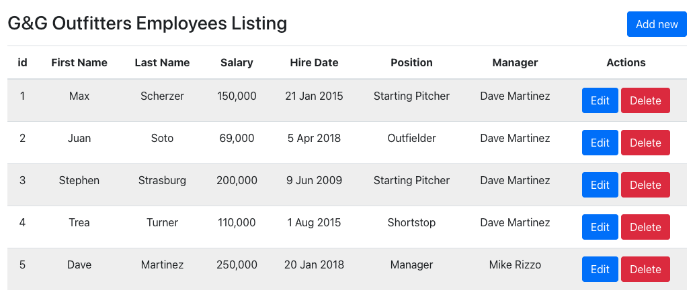
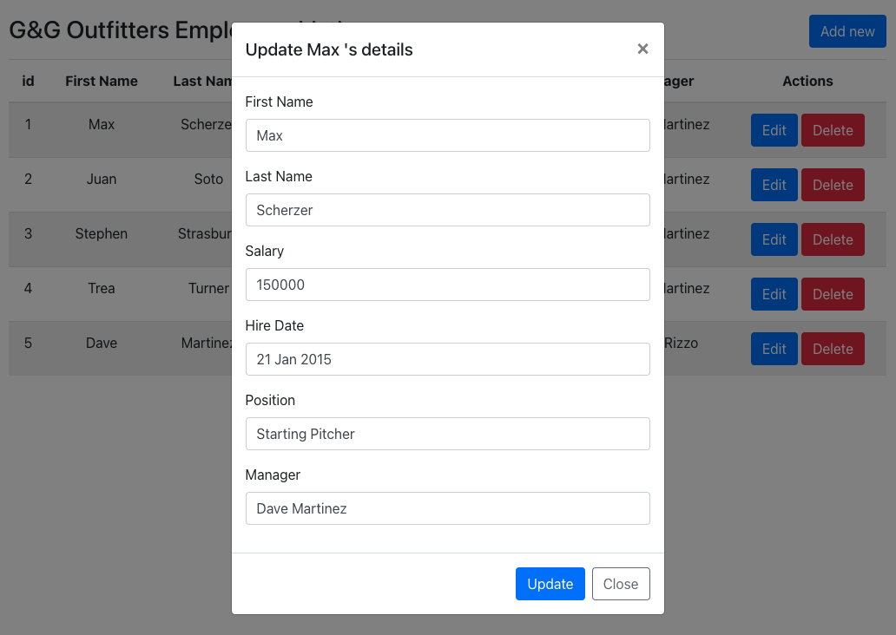
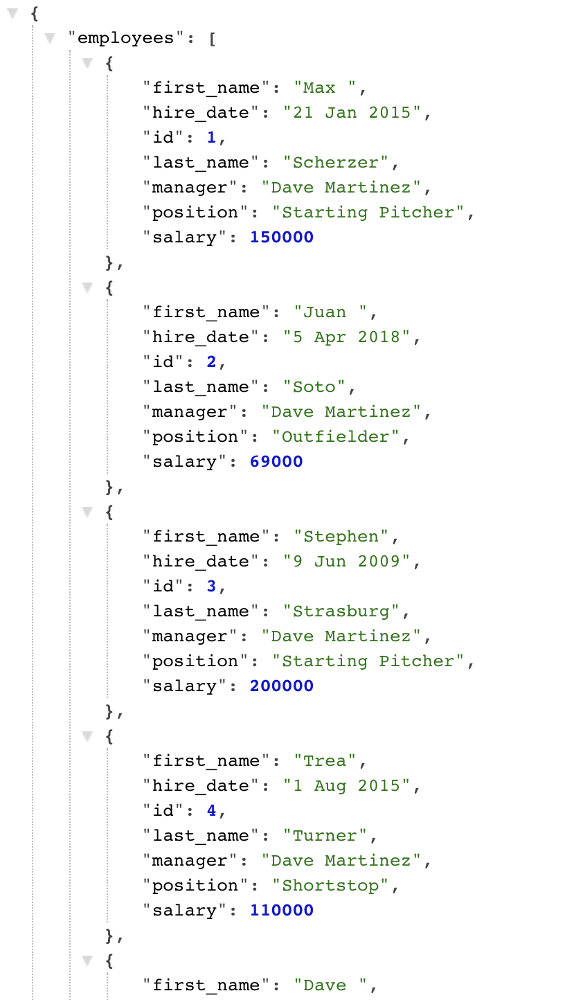

# G&G Outfitters Employee Management App

Created by Injae Lee, 18 Dec 2020

## Demo Video
(https://www.youtube.com/watch?v=77zzYwqNyGU)

## Instructions

1. Type <npm run start-flask> in terminal to run flask server
2. Type <npm install> for react-bootsrap dependency installation
3. Type <npm start> in a separate terminal to run frontend
4. You can view data JSON at http://localhost:5000/employees
5. Enjoy the app and any feedback is welcomed! 

## Backend

Python

Flask

SQLAlchemy

SQlite3

## Frontend

React

useState hook for state management

Reactstrap / Bootstrap for Table, Form, and Modal UI

### App sample images 

